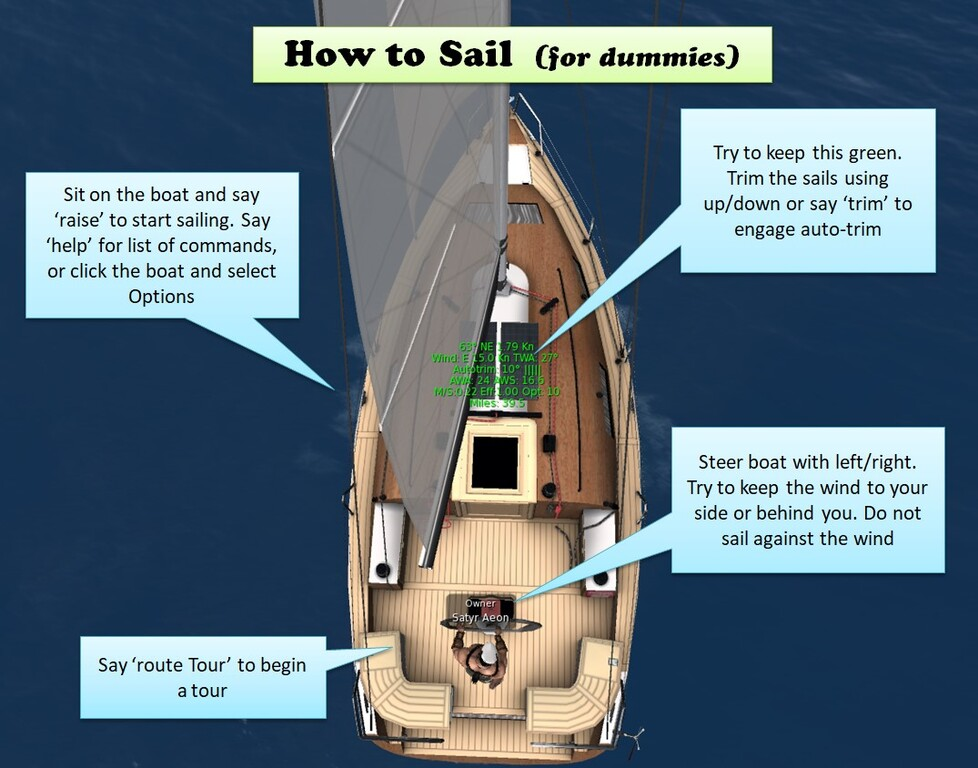

# SFsail sailing engine

Learn more at https://opensimworld.com/sfsail

SFsail is a new sailing engine written from scratch for OpenSim. It works similarly to BWind and has mostly similar commands. Sit on a boat and say 'help' for a list of commands.

You can find the SFsail boats in the OpenSimWorld Region: hg.osgrid.org:80:OpenSimWorld



## How to use the boats

* Boats are tuned to BulletSim by default. If you use ubODE, edit the `.SFsail` script and change the setting `IS_UBODE=1`
* The first avatar who sits on a boat is the commander. If the commander stands up the boat moors. Another person can then sit to operate  the boat
* You can operate the boat with left/right arrows (steering), forward/back arrows (trim of the sails) and PgUp/PgDown to rotate the Spinnaker
* Say 'raise' to raise mainsail + jib
* Say 'lower' to lower all sails
* Say 'moor' to stop and anchor the boat
* Say 'jib' to hoist/lower the jib
* Say 'genoa' to hoist/lower genoa (if available)
* Say 'spin' to hoist/lower spinnaker (if available)
* Say 'trim' to engage Autotrim which automatically trims the sails to their optimal angles
* Say 'hold' to keep the boat pointing at the same angle
* Say 'flip' when the boat is moored to flip the boat (useful when stuck on a dock)
* Say 'motor' to turn on the motor. Then use the up/down arrows to change throttle. Say 'moor' to stop  the boat
* Say one of n,s,e,w,nw,ne,sw,se to set the Wind direction
* Say 8,11,15,18,21,25  to set the Wind speed
* Say 'hud' to turn on/off the hover text of the boat
* Say 'adv' to turn on/off advanced hud text
* Say 'milesreset' to reset the miles counter (shown in the hud)
* Say 'setter' to enable/disable listening to the region wind setter (or SFsail Manager)
* Say 'dest x y' to engage the autopilot to steer towards the region coordinates x,y
* Say 'dest x1 y1 x2 y2 x3 y3 ...'  to engage autopilot to follow the route from region points x1 y1 ...  Say 'stop' to stop autopilot
* Say 'follow <avatar name or object name>' to engage autopilot to follow another avatar or another boat. Say 'stop' to stop following
* Say 'route <route-name>' to begin a rout (requires Sail Manager / See below)
* Say 'stop' to stop the autopilot / stop following

## routes manager / wind setter
The 'SFsail Manager' object is a wind setter (creates wind for the 'setter' command), and a place to rez and store your boat routes. If you don't already have a wind setter, touch it and select 'Setter ON'.

Boat routes are stored in the notecard '.Sailroutes' inside the manager object, which contains lines with routes. In each line, the x y coordinates of a route are defined (similar to the 'dest' command).

Each line is as follows:
```
<Route Name>=x1 y1 x2 y2 x3 y3  x4 y4  ...
```

For example a  route named 'Tour' line could be:
```
Tour=150 160 270 380 200 100 160 160
```

You can then engage the autopilot to join this route from any boat by saying:
```
route Tour
```

The boat will join the route at the nearest point of the route and continue until the end. You can stop the autopilot at any time by saying 'stop'

You can use the object "SFsail Route helper" to help you make a route quickly. Rez it over water, and then, for each point, move it and then touch it. The route will be printed in the chat for you.

 (Note: routes are approximate, the boat will try to reach within 10 meters of each route point. You will have to correct the boat if it goes against the wind)

## Rez a boat with NPC that follows you
You can use a second boat and an NPC to follow your boat. Rez a second boat that will follow you. Edit .SFconfig and change "Firstname Lastname" to your own avatar name, for example:
```
Button=FollowMe=LINKMSG{-4;889;follow Satyr Aeon}
```
Then sit and unsit to reload the configuration. Then Right click to touch the boat (without sitting) and select Options ->NPCs->ADD->Sailor. The NPC "Sailor" should sit on the boat now. Touch the boat again and select Options -> FollowMe , then select Options -> Autotrim and then select Options->Raise. The boat with the NPC will now follow you. You can sit on your own boat and sail together.

## Configuration

You can change the configuration variables at the top of the .SFsail script to tune your boat.

* `IS_UBODE=0`  // Change this to 1 if you are using UBode
* `ACCESS = "A"`  // Change who can drive the boat. the setting can be: "A"=All  "G"=Group "O"=Owner only
* `MAX_ANGLE = 70`     Maximum allowed boom angle
* `HUD_ON=1`     // Change this to 0 if you don't want the Hover text by default
* `ADV_HUD=1`     // Change this to 0 if you don't want want advanced info in the Hover text
* `THROTTLE_MAX=5` // Change this to the maximum throttle of the motor
* `SPEEDUP=0.9`        // Change this to larger or lower values to make the boat overall faster / slower
* `ENABLE_DYCAM = 1`  // Change this to 0 to  disable the dynamic camera
* `KEELING = 0.2`     //  Change this to larger or lower values to make the boat keel more or less
* `LEEWAY = 0.2`      //  Change this to larger or lower values to make the boat to have more leeway (sideways drift)

## SFposer buttons

The SFsail boats use SFposer  to handle the animations. SFposer Buttons are added to the Options menu to send commands to the boat.  The boat accepts commands through link_messages with num=889

To add an SFposer button, add a Button line to the .SFconfig notecard. For example to add a button to hoist the genoa, add the following line to .SFconfig:
```
Button=Genoa=LINKMSG{-4;889;genoa}
```

Similarly, you can create a route for a boat by sending an appropriate 'dest' command:
```
Button=Start Route=LINKMSG{-4;889;dest 150 160 270 380 200 100 160 160}
```

The SFsail boats contain a button for the boat to follow you. You need to edit .SFconfig to replace "Firstname Lastname" in the Button's configuration line with your own avatar's name:
```
Button=FollowMe=LINKMSG{-4;889;follow Satyr Aeon}
```

The SFsailboats come preloaded with one NPC named 'Sailor'. To rez the NPC to follow you with his boat, click Options->NPCs->Add NPC->Sailor, then Options->AutoTrim, then Options->FollowMe, and finally Options->Raise.

# Warnings

The boats do not support crossing regions, unless you have OSSL permissions in both regions.

# Copyright

SFsail is licensed under the GNU General Public Licence v3 (GPLv3)

SFsail is inspired by the BWind engine, but it does not contain any parts of it.

Copyright (c) Satyr Aeon

